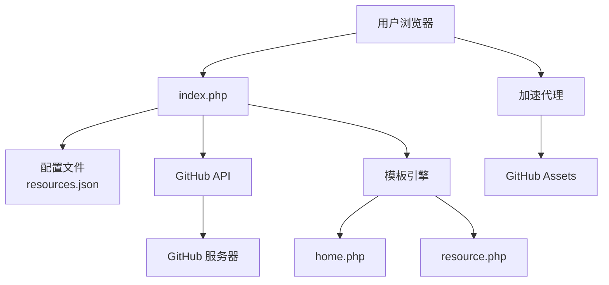

# 系统架构文档

## 架构概述

本项目采用单文件 PHP 架构设计，所有业务逻辑集中在 `index.php` 文件中，配合简单的模板分离。这种设计适合免费虚拟主机环境，无需复杂配置。

## 架构图



## 组件说明

### 1. 主入口 (index.php)

**职责**:
- 路由分发
- 配置读取
- GitHub API 调用
- URL 生成
- 模板渲染

**核心函数**:

| 函数名 | 功能 | 参数 | 返回值 |
|--------|------|------|--------|
| `getConfig()` | 读取 JSON 配置 | 无 | array\|null |
| `getResource()` | 查找资源 | config, owner, repo | array\|null |
| `validateResource()` | 验证资源字段 | resource | array |
| `getGitHubReleases()` | 获取 release 列表 | owner, repo, includePrerelease | array |
| `buildAcceleratedUrl()` | 生成加速链接 | proxyUrl, githubUrl | string |
| `formatFileSize()` | 格式化文件大小 | bytes | string |
| `formatDate()` | 格式化日期 | date | string |
| `getRoute()` | 获取当前路由 | 无 | string |
| `render()` | 渲染模板 | template, data | void |

### 2. 配置文件 (data/resources.json)

**结构**:
```json
{
    "proxyUrl": "加速代理地址",
    "resources": [
        {
            "name": "资源名称",
            "owner": "仓库拥有者",
            "repo": "仓库名",
            "description": "简介",
            "usePrerelease": false
        }
    ]
}
```

### 3. 路由系统

| 路径 | 参数 | 模板 | 功能 |
|------|------|------|------|
| `/` | 无 | home.php | 资源列表页 |
| `/resource` | owner, repo | resource.php | 资源详情页 |

### 4. GitHub API 集成

**API 端点**:
```
GET https://api.github.com/repos/{owner}/{repo}/releases?per_page=3
```

**请求头**:
```
Accept: application/vnd.github.v3+json
User-Agent: GitHub-Accel-Downloader/1.0
```

**速率限制**:
- 未认证：60 次/小时
- 超出限制返回 HTTP 403

### 5. 加速代理机制

**转换规则**:
```
原始：https://github.com/owner/repo/releases/download/v1.0/file.apk
加速：https://<proxyUrl>/https://github.com/owner/repo/releases/download/v1.0/file.apk
```

**支持的代理服务**:
- ghproxy.net
- ghproxy.com
- github.moeyy.xyz

## 数据流

### 首页访问流程

```
用户请求 → index.php → getConfig() → render(home.php)
                                      ↓
                                  遍历 resources[] → 显示资源卡片
```

### 详情页访问流程

```
用户请求 ?owner=X&repo=Y
    ↓
index.php → getResource() → 验证资源
    ↓
getGitHubReleases() → GitHub API
    ↓
    ↓ (成功)
    ↓
render(resource.php) → 显示版本列表和下载链接
    ↓
buildAcceleratedUrl() → 生成加速链接
```

## 错误处理架构

```
错误类型 → 检测 → 响应
    │
    ├── JSON 解析失败 → getConfig() 返回 null → HTTP 500
    ├── 资源不存在 → getResource() 返回 null → HTTP 404
    ├── GitHub API 403 → getGitHubReleases() → 显示警告提示
    ├── GitHub API 404 → getGitHubReleases() → 显示错误提示
    └── 网络错误 → curl_error() → 显示错误提示
```

## 前端架构

### 响应式布局

使用 Bootstrap 5.3 响应式网格系统：

- 大屏幕 (lg): 3 列布局
- 中等屏幕 (md): 2 列布局
- 小屏幕：1 列布局

### 交互功能

- Release body 展开/收起（JavaScript）
- 加速下载新标签页打开（target="_blank"）
- Bootstrap 卡片悬停效果（CSS）

## 安全考量

### 已实现的安全措施

1. **XSS 防护**: 所有用户输入使用 `htmlspecialchars()` 转义
2. **错误信息控制**: 关闭 `display_errors`，避免泄露敏感信息
3. **URL 验证**: 资源 owner/repo 通过配置的白名单获取，不接受任意输入

### 潜在风险

1. **GitHub API 滥用**: 频繁请求会触发速率限制
2. **代理服务可信度**: 第三方代理可能记录下载行为

## 性能优化

### 已实现优化

1. **单次请求单 API 调用**: 每个详情页只调用一次 GitHub API
2. **限制返回数量**: API 请求 `per_page=3`，减少响应大小
3. **cURL 超时设置**: 30 秒超时，避免长时间等待

### 潜在优化方向

1. **增加缓存**: 使用文件缓存 GitHub API 响应（需解决缓存失效问题）
2. **使用认证 Token**: 提高 API 速率限制
3. **预生成静态页面**: 定期后台更新 release 信息

## 部署架构

```
虚拟主机 (PHP 7.4+)
    ├── github-accel-downloader/
    │   ├── index.php           # 入口文件
    │   ├── data/
    │   │   └── resources.json  # 配置文件（可读写）
    │   └── templates/          # 模板目录
    └── .monkeycode/docs/       # 文档目录
```

**环境要求**:
- PHP 7.4+
- cURL 扩展
- 允许访问外部 URL（fopen/cURL）
- 无需数据库
- 无需写入权限（除日志外）
